# Layer Architecture

> Understanding the 5-layer system architecture of Claude Code agentic systems

---

## Overview

Claude Code operates through a layered architecture where each layer has specific responsibilities and communication patterns.

```
┌─────────────────────────────────────────────────────────────────────────────┐
│                         5-LAYER ARCHITECTURE                                │
├─────────────────────────────────────────────────────────────────────────────┤
│                                                                             │
│  ┌─────────────────────────────────────────────────────────────────────┐   │
│  │  👤 LAYER 1: USER LAYER                                             │   │
│  │  Human input, 🦴 /commands, natural language prompts                │   │
│  └────────────────────────────────┬────────────────────────────────────┘   │
│                                   │                                         │
│                                   ▼                                         │
│  ┌─────────────────────────────────────────────────────────────────────┐   │
│  │  🧠 LAYER 2: MAIN AGENT LAYER                                       │   │
│  │  Claude Code - orchestration, decision-making, routing              │   │
│  └────────────────────────────────┬────────────────────────────────────┘   │
│                                   │                                         │
│                    ┌──────────────┼──────────────┐                         │
│                    ▼              ▼              ▼                          │
│  ┌─────────────────────────────────────────────────────────────────────┐   │
│  │  🔀 LAYER 3: DELEGATION LAYER                                       │   │
│  │  🦴 Slash Commands, 📚 Skills - workflow definition                 │   │
│  └────────────────────────────────┬────────────────────────────────────┘   │
│                                   │                                         │
│                                   ▼                                         │
│  ┌─────────────────────────────────────────────────────────────────────┐   │
│  │  🔌 LAYER 4: EXECUTION LAYER                                        │   │
│  │  🤖 Subagents, 🔌 Tools - actual work execution                     │   │
│  └────────────────────────────────┬────────────────────────────────────┘   │
│                                   │                                         │
│                                   ▼                                         │
│  ┌─────────────────────────────────────────────────────────────────────┐   │
│  │  💾 LAYER 5: STATE LAYER                                            │   │
│  │  Memory, Files, Context - persistence and state management          │   │
│  └─────────────────────────────────────────────────────────────────────┘   │
│                                                                             │
└─────────────────────────────────────────────────────────────────────────────┘
```

---

## 👤 Layer 1: User Layer

### Purpose
Entry point for all interactions with the system.

### Components

| Component | Emoji | Description | Example |
|-----------|-------|-------------|---------|
| **Natural Language** | 👤 | Free-form requests | "Fix the authentication bug" |
| **Slash Commands** | 🦴 | Structured invocations | `/generate fr-FR` |
| **File References** | 📁 | Code/doc references | `@src/auth.ts` |

### Mermaid Diagram

```mermaid
%%{init: {'theme': 'base', 'themeVariables': {'lineColor': '#64748b'}}}%%
flowchart LR
    classDef user fill:#6366f1,stroke:#4f46e5,stroke-width:2px,color:#ffffff
    classDef main fill:#8b5cf6,stroke:#7c3aed,stroke-width:2px,color:#ffffff

    subgraph UserLayer["👤 User Layer"]
        NL["👤 Natural Language<br>'Fix the bug'"]:::user
        SC["🦴 /command args"]:::user
        FR["📁 @file/path"]:::user
    end

    NL --> MA["🧠 Main Agent"]:::main
    SC --> MA
    FR --> MA

    style UserLayer fill:#e0e7ff,stroke:#6366f1,stroke-width:2px
```

### Key Behaviors
- All input normalized before reaching 🧠 Main Agent
- 🦴 Slash commands expand to full prompts
- File references inject content

---

## 🧠 Layer 2: Main Agent Layer

### Purpose
Central orchestrator that interprets intent and coordinates execution.

### Responsibilities

| Responsibility | Description |
|----------------|-------------|
| **Intent Recognition** | Understand what user wants |
| **Pattern Selection** | Choose appropriate execution pattern |
| **Task Delegation** | Spawn 🤖 subagents or use 🔌 tools |
| **Result Synthesis** | Combine results into coherent response |

### Critical Rule

> **The 🧠 Main Agent is the ONLY entity that can spawn 🤖 Subagents.**
>
> 🤖 Subagents cannot spawn other subagents. All delegation flows through the 🧠 Main Agent.

### Mermaid Diagram

```mermaid
%%{init: {'theme': 'base', 'themeVariables': {'lineColor': '#64748b'}}}%%
flowchart TB
    classDef main fill:#8b5cf6,stroke:#7c3aed,stroke-width:2px,color:#ffffff
    classDef user fill:#6366f1,stroke:#4f46e5,stroke-width:2px,color:#ffffff
    classDef tool fill:#f59e0b,stroke:#d97706,stroke-width:2px,color:#ffffff

    subgraph MainAgentLayer["🧠 Main Agent Layer"]
        direction TB
        INTENT[Intent Recognition]
        PATTERN[Pattern Selection]
        DELEGATE[Task Delegation]
        SYNTH[Result Synthesis]

        INTENT --> PATTERN
        PATTERN --> DELEGATE
        DELEGATE --> SYNTH
    end

    INPUT["👤 User Input"]:::user --> INTENT
    SYNTH --> OUTPUT["👤 User Response"]:::user
    DELEGATE --> EXEC["🔌 Execution Layer"]:::tool
    EXEC --> SYNTH

    style MainAgentLayer fill:#f3e8ff,stroke:#8b5cf6,stroke-width:2px
```

### Decision Points

```mermaid
%%{init: {'theme': 'base', 'themeVariables': {'lineColor': '#64748b'}}}%%
flowchart TD
    classDef start fill:#10b981,stroke:#059669,stroke-width:2px,color:#ffffff
    classDef wizard fill:#14b8a6,stroke:#0d9488,stroke-width:2px,color:#ffffff
    classDef parallel fill:#3b82f6,stroke:#2563eb,stroke-width:2px,color:#ffffff

    START["👤 User Request"]:::start --> Q1{Complex task?}
    Q1 -->|Yes| Q2{Independent subtasks?}
    Q1 -->|No| DIRECT[Direct Execution]

    Q2 -->|Yes| PARALLEL["🚂 Parallel Subagents"]:::parallel
    Q2 -->|No| Q3{Requires confirmation?}

    Q3 -->|Yes| WIZARD["🧙 Wizard Workflow"]:::wizard
    Q3 -->|No| SEQUENTIAL[Sequential Execution]
```

---

## 🔀 Layer 3: Delegation Layer

### Purpose
Defines workflows and provides reusable capabilities to the 🧠 Main Agent.

### Components

| Component | Emoji | Role | Triggered By |
|-----------|-------|------|--------------|
| **Slash Commands** | 🦴 | Define multi-step workflows | User `/command` |
| **Skills** | 📚 | Provide methodologies | Context matching |

### 🦴 Slash Command Flow

```mermaid
%%{init: {'theme': 'base', 'themeVariables': {'lineColor': '#64748b'}}}%%
sequenceDiagram
    participant U as 👤 User
    participant CMD as 🦴 Slash Command
    participant MA as 🧠 Main Agent
    participant E as 🔌 Execution

    U->>CMD: /generate fr-FR
    CMD->>CMD: Expand to prompt
    CMD->>MA: Full prompt + args
    MA->>E: Execute workflow
    E-->>MA: Results
    MA-->>U: Response
```

### 📚 Skill Loading

```mermaid
%%{init: {'theme': 'base', 'themeVariables': {'lineColor': '#64748b'}}}%%
flowchart LR
    classDef skill fill:#10b981,stroke:#059669,stroke-width:2px,color:#ffffff
    classDef decision fill:#f59e0b,stroke:#d97706,stroke-width:2px,color:#ffffff

    REQ[Request] --> CHECK{"📚 Matches Skill?"}:::decision
    CHECK -->|Yes| LOAD["📚 Load Skill"]:::skill
    CHECK -->|No| CONTINUE[Continue]
    LOAD --> ENHANCE[Enhanced Context]
    ENHANCE --> EXEC[Execute]
    CONTINUE --> EXEC
```

---

## 🔌 Layer 4: Execution Layer

### Purpose
Where actual work happens - code execution, file operations, API calls.

### Components

| Component | Emoji | Function | Spawned By |
|-----------|-------|----------|------------|
| **Subagents** | 🤖 | Autonomous task execution | 📤 Task tool |
| **Tools** | 🔌 | Direct operations | 🧠 Main Agent / 🤖 Subagents |

### 🤖 Subagent Lifecycle

```mermaid
%%{init: {'theme': 'base', 'themeVariables': {'lineColor': '#64748b'}}}%%
stateDiagram-v2
    [*] --> Spawned: 📤 Task tool called
    Spawned --> Executing: Receives prompt
    Executing --> Working: Uses 🔌 tools
    Working --> Working: Iterates
    Working --> Completed: ✅ Task done
    Completed --> [*]: Returns result

    note right of Working
        🤖 Cannot spawn
        other subagents
    end note
```

### 🔌 Tool Categories

```mermaid
mindmap
    root(("🔌 Tools"))
        File Operations
            Read
            Write
            Edit
            Glob
            Grep
        System
            Bash
            📤 Task
        Web
            WebFetch
            WebSearch
        User Interaction
            ❓ AskUserQuestion
            TodoWrite
```

### 🚂 Parallel Execution

```mermaid
%%{init: {'theme': 'base', 'themeVariables': {'lineColor': '#64748b'}}}%%
flowchart TB
    classDef main fill:#8b5cf6,stroke:#7c3aed,stroke-width:2px,color:#ffffff
    classDef subagent fill:#ec4899,stroke:#db2777,stroke-width:2px,color:#ffffff
    classDef state fill:#10b981,stroke:#059669,stroke-width:2px,color:#ffffff

    MA["🧠 Main Agent"]:::main

    MA -->|📤 Task| SA1["🤖 Subagent 1"]:::subagent
    MA -->|📤 Task| SA2["🤖 Subagent 2"]:::subagent
    MA -->|📤 Task| SA3["🤖 Subagent 3"]:::subagent

    SA1 --> R1[Result 1]
    SA2 --> R2[Result 2]
    SA3 --> R3[Result 3]

    R1 --> MERGE["✅ Merge Results"]:::state
    R2 --> MERGE
    R3 --> MERGE

    MERGE --> MA
```

---

## 💾 Layer 5: State Layer

### Purpose
Persistence, memory, and context management across interactions.

### Components

| Component | Emoji | Type | Scope |
|-----------|-------|------|-------|
| **Memory** | 💾 | In-session context | Conversation |
| **Files** | 📁 | Persistent storage | Project |
| **CLAUDE.md** | 📋 | Project instructions | Project |
| **Checkpoints** | 🖥️ | Resume points | Workflow |

### 💾 State Flow

```mermaid
%%{init: {'theme': 'base', 'themeVariables': {'lineColor': '#64748b'}}}%%
flowchart TB
    classDef state fill:#10b981,stroke:#059669,stroke-width:2px,color:#ffffff
    classDef main fill:#8b5cf6,stroke:#7c3aed,stroke-width:2px,color:#ffffff
    classDef tool fill:#f59e0b,stroke:#d97706,stroke-width:2px,color:#ffffff

    subgraph StateLayer["💾 State Layer"]
        MEM["💾 Session Memory"]:::state
        FILES["📁 File System"]:::state
        CLAUDE["📋 CLAUDE.md"]:::state
        CHECK["🖥️ Checkpoints"]:::state
    end

    EXEC["🔌 Execution Layer"]:::tool -->|Reads/Writes| FILES
    EXEC -->|Updates| MEM
    EXEC -->|Saves| CHECK
    MA["🧠 Main Agent"]:::main -->|Loads| CLAUDE
    MA -->|Accesses| MEM
    MA -->|Resumes from| CHECK

    style StateLayer fill:#ecfdf5,stroke:#10b981,stroke-width:2px
```

### 🖥️ Checkpointing for Long Workflows

```mermaid
%%{init: {'theme': 'base', 'themeVariables': {'lineColor': '#64748b'}}}%%
flowchart LR
    classDef checkpoint fill:#f59e0b,stroke:#d97706,stroke-width:2px,color:#ffffff

    subgraph Workflow
        P1["🏗️ Phase 1"] --> CP1["🖥️ Checkpoint"]:::checkpoint
        CP1 --> P2["🔗 Phase 2"]
        P2 --> CP2["🖥️ Checkpoint"]:::checkpoint
        CP2 --> P3["📝 Phase 3"]
    end

    FAIL["❌ Failure/Interrupt"] -.->|Resume from| CP2
```

---

## Complete Layer Interaction

```mermaid
%%{init: {'theme': 'base', 'themeVariables': {'lineColor': '#64748b'}}}%%
sequenceDiagram
    participant U as 👤 User Layer
    participant MA as 🧠 Main Agent Layer
    participant DL as 🔀 Delegation Layer
    participant EL as 🔌 Execution Layer
    participant SL as 💾 State Layer

    U->>MA: 🦴 /generate fr-FR

    MA->>DL: Load 🦴 command
    DL-->>MA: Expanded prompt

    MA->>SL: Load 📋 CLAUDE.md context
    SL-->>MA: Project instructions

    MA->>EL: 📤 Task(🤖 subagent)
    EL->>SL: Read source files
    SL-->>EL: File contents
    EL->>SL: Write output files
    EL-->>MA: ✅ Completion report

    MA->>SL: Save 🖥️ checkpoint
    MA-->>U: "✅ Generated 9 files for fr-FR"
```

---

## Layer Responsibilities Matrix

| Layer | Emoji | Input | Process | Output |
|-------|-------|-------|---------|--------|
| **User** | 👤 | Human action | Normalize | Prompt/Command |
| **Main Agent** | 🧠 | Prompt | Orchestrate | Delegation calls |
| **Delegation** | 🔀 | Command/Context | Define workflow | Structured task |
| **Execution** | 🔌 | Task | Execute | Results |
| **State** | 💾 | Data | Persist | Stored state |

---

## Anti-Patterns

### ❌ Wrong: 🤖 Subagent Spawning 🤖 Subagent

```mermaid
%%{init: {'theme': 'base', 'themeVariables': {'lineColor': '#64748b'}}}%%
flowchart LR
    classDef error fill:#ef4444,stroke:#dc2626,stroke-width:2px,color:#ffffff
    classDef main fill:#8b5cf6,stroke:#7c3aed,stroke-width:2px,color:#ffffff

    MA["🧠 Main Agent"]:::main --> SA1["🤖 Subagent 1"]:::error
    SA1 -->|"❌ WRONG"| SA2["🤖 Subagent 2"]:::error
```

### ✅ Correct: 🧠 Main Agent Orchestrates All

```mermaid
%%{init: {'theme': 'base', 'themeVariables': {'lineColor': '#64748b'}}}%%
flowchart TB
    classDef main fill:#8b5cf6,stroke:#7c3aed,stroke-width:2px,color:#ffffff
    classDef subagent fill:#ec4899,stroke:#db2777,stroke-width:2px,color:#ffffff

    MA["🧠 Main Agent"]:::main

    MA -->|📤 Task| SA1["🤖 Subagent 1"]:::subagent
    MA -->|📤 Task| SA2["🤖 Subagent 2"]:::subagent

    SA1 -->|Result| MA
    SA2 -->|Result| MA
```

---

*See [03-ANTHROPIC-RESEARCH-PATTERNS.md](03-ANTHROPIC-RESEARCH-PATTERNS.md) for theoretical patterns →*
