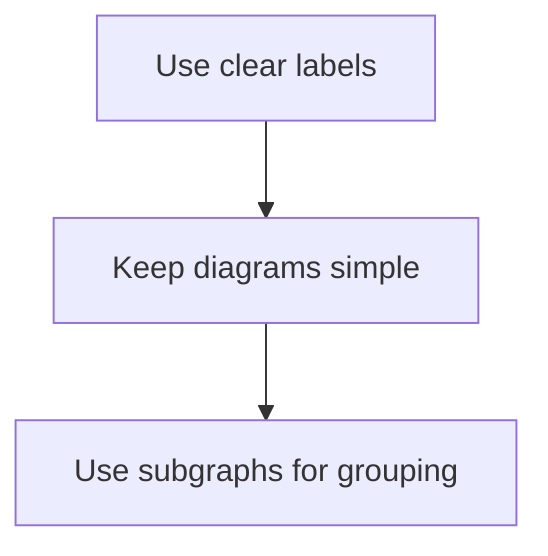

# Contributing to Claude Agentic Patterns

Thank you for your interest in contributing to this collection of Claude agentic patterns! This document provides guidelines for contributing new patterns, improving existing ones, and maintaining quality standards.

---

## Table of Contents

- [Code of Conduct](#code-of-conduct)
- [Ways to Contribute](#ways-to-contribute)
- [Pattern Requirements](#pattern-requirements)
- [Pattern Template](#pattern-template)
- [Submission Process](#submission-process)
- [Review Criteria](#review-criteria)
- [Style Guide](#style-guide)

---

## Code of Conduct

- Be respectful and constructive
- Focus on technical merit
- Credit original sources
- Help maintain quality over quantity

---

## Ways to Contribute

### 1. Add a New Pattern

Document a pattern from official Anthropic sources that isn't covered yet.

**Requirements:**
- Pattern must be sourced from Anthropic documentation, blog posts, or official examples
- Include working code examples
- Provide Mermaid diagrams for visualization
- Follow the pattern template

### 2. Improve Existing Patterns

- Add more code examples
- Improve explanations
- Fix errors or outdated information
- Add edge cases or best practices

### 3. Fix Issues

- Correct typos or grammar
- Fix broken links
- Update deprecated code
- Improve diagram clarity

### 4. Add Translations

Help make patterns accessible globally by translating to other languages.

---

## Pattern Requirements

All patterns must meet these criteria:

### Source Requirements

| Requirement | Description |
|-------------|-------------|
| **Official Source** | Link to Anthropic docs, blog post, or official repo |
| **Validation** | Pattern must be documented or endorsed by Anthropic |
| **Currency** | Information must be current (check against latest docs) |

### Content Requirements

| Requirement | Description |
|-------------|-------------|
| **Overview** | Clear explanation of what the pattern does |
| **When to Use** | Specific scenarios where this pattern applies |
| **Architecture** | Mermaid diagram showing the pattern structure |
| **Implementation** | Working code examples |
| **Best Practices** | Do's and Don'ts |
| **References** | Links to source documentation |

### Quality Requirements

| Requirement | Description |
|-------------|-------------|
| **Tested Code** | All code examples must be tested |
| **Clear Diagrams** | Mermaid diagrams must render correctly |
| **Consistent Format** | Follow the established template |
| **No Hallucinations** | Only document verified patterns |

---

## Pattern Template

Use this template for new patterns:

```markdown
# Pattern N: Pattern Name

> One-line description of what the pattern does.

---

## Overview

Explain the pattern in 2-3 paragraphs:
- What problem does it solve?
- How does it work at a high level?
- What are the key benefits?

## Architecture

\`\`\`mermaid
flowchart TB
    subgraph Main["Main Component"]
        A[Step 1]
        B[Step 2]
    end
    A --> B
\`\`\`

## When to Use

### Good Fit

| Scenario | Why |
|----------|-----|
| Scenario 1 | Explanation |
| Scenario 2 | Explanation |

### Poor Fit

| Scenario | Better Alternative |
|----------|-------------------|
| Scenario 1 | Alternative pattern |
| Scenario 2 | Alternative pattern |

## Implementation

### Basic Example

\`\`\`python
# Working code example
def example():
    pass
\`\`\`

### Advanced Example

\`\`\`python
# More complex example
class AdvancedExample:
    pass
\`\`\`

## Best Practices

### Do

- Best practice 1
- Best practice 2
- Best practice 3

### Don't

- Anti-pattern 1
- Anti-pattern 2
- Anti-pattern 3

## Combining with Other Patterns

Explain how this pattern works with others in the collection.

---

## References

- [Source 1](https://anthropic.com/...)
- [Source 2](https://docs.anthropic.com/...)
```

---

## Submission Process

### Step 1: Check Existing Patterns

Before submitting, verify that:
- The pattern isn't already documented
- The pattern has an official Anthropic source
- Your contribution adds unique value

### Step 2: Create an Issue (Optional)

For new patterns, consider creating an issue first to discuss:
- Whether the pattern belongs in this collection
- The scope and approach
- Any questions about implementation

### Step 3: Fork and Branch

```bash
# Fork the repository on GitHub, then:
git clone https://github.com/YOUR-USERNAME/claude-agentic-patterns.git
cd claude-agentic-patterns
git checkout -b feature/pattern-name
```

### Step 4: Write Your Contribution

- Follow the pattern template
- Test all code examples
- Verify Mermaid diagrams render correctly
- Check links are valid

### Step 5: Submit Pull Request

```bash
git add .
git commit -m "Add: Pattern Name - brief description"
git push origin feature/pattern-name
```

Then create a Pull Request with:
- Clear title describing the change
- Link to the Anthropic source
- Summary of what the pattern does
- Any notes for reviewers

---

## Review Criteria

Pull requests are reviewed against these criteria:

### Must Have

- [ ] References official Anthropic source
- [ ] Includes working code examples
- [ ] Has Mermaid diagrams
- [ ] Follows the pattern template
- [ ] No broken links
- [ ] Correct grammar and spelling

### Nice to Have

- [ ] Multiple code examples (different languages/frameworks)
- [ ] Edge cases documented
- [ ] Performance considerations
- [ ] Comparison with similar patterns

### Rejection Reasons

- No official Anthropic source
- Duplicate of existing pattern
- Hallucinated or unverified information
- Poor quality or incomplete content
- Doesn't follow template

---

## Style Guide

### Markdown

- Use ATX-style headers (`#`, `##`, `###`)
- One blank line between sections
- Use tables for structured comparisons
- Use code fences with language identifiers

### Mermaid Diagrams



- Keep diagrams focused on one concept
- Use subgraphs to group related items
- Use consistent styling within a pattern
- Test that diagrams render on GitHub

### Code Examples

- Use descriptive variable names
- Include comments for complex logic
- Show both basic and advanced usage
- Prefer Python and TypeScript examples

### Writing

- Write in clear, concise English
- Use active voice
- Define technical terms
- Link to external resources for deep dives

---

## Questions?

If you have questions about contributing:

1. Check existing issues for similar questions
2. Create a new issue with the `question` label
3. Reference this guide in your question

---

## Recognition

Contributors are recognized in:
- Pull request acknowledgments
- Pattern attribution (if adding a new pattern)
- Repository contributors list

Thank you for helping make this the best collection of Claude agentic patterns!
