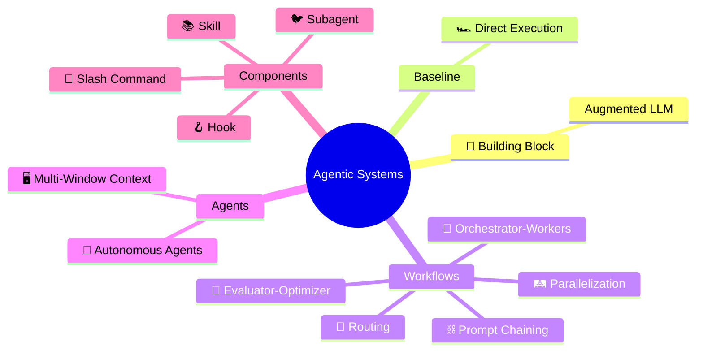
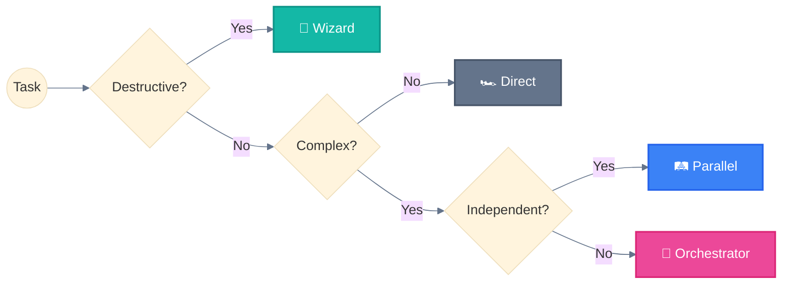

<div align="center">

# Agentic AI Systems 🐔

**Design patterns for building agentic AI systems | Explained simply**

<sub>Mermaid diagrams 📊 • Clear examples 💡 • Chicken metaphors 🐔🐦<br/>
Because complex patterns deserve simple explanations.</sub>

<br/>

<!-- Credibility -->
<a href="https://docs.anthropic.com/en/docs/claude-code">
  
</a>
<a href="https://www.anthropic.com/research/building-effective-agents">
  
</a>
<a href="https://github.com/hesreallyhim/awesome-claude-code">
  
</a>

<br/>

<!-- Stats -->


</div>

---

## Why This Repo? 🪺

Building effective AI agents requires proven patterns, not guesswork.

This repository distills **official Anthropic documentation** into actionable designs:

| What you get | Why it matters |
|--------------|----------------|
| 📊 **Mermaid diagrams** | See the architecture, don't just read about it |
| 💡 **Clear examples** | Copy-paste ready, not abstract theory |
| 🗺️ **Decision guides** | Know which pattern fits your use case |
| 🐔 **Chicken metaphors** | Remember patterns, not jargon |

*Why chickens? Because 🐔 Main Agent spawning 🐦 Subagents is way easier to remember than "hierarchical agent orchestration".*

---

## 🗺️ Navigation Hub

<table>
<tr>
<td width="50%" valign="top">

### 📚 Agentic Systems
**Theory & Patterns** — [Browse →](agentic-systems/)

| # | Pattern | Link |
|:-:|---------|:----:|
| 0 | 🧱 Building Block | [→](agentic-systems/00-building-block.md) |
| 1 | 🏎️ Baseline | [→](agentic-systems/01-baseline.md) |
| 2 | ⛓️ Prompt Chaining | [→](agentic-systems/02-prompt-chaining.md) |
| 3 | 🚦 Routing | [→](agentic-systems/03-routing.md) |
| 4 | 🛤️ Parallelization | [→](agentic-systems/04-parallelization.md) |
| 5 | 🦑 Orchestrator-Workers | [→](agentic-systems/05-orchestrator-workers.md) |
| 6 | 🩻 Evaluator-Optimizer | [→](agentic-systems/06-evaluator-optimizer.md) |
| 7 | 🐉 Autonomous Agents | [→](agentic-systems/07-autonomous-agents.md) |
| 8 | 🖥️ Multi-Window Context | [→](agentic-systems/08-multi-window-context.md) |

</td>
<td width="50%" valign="top">

### 🧩 Components
**Claude Code building blocks** — [Browse →](implementation/components/)

| Component | Location |
|-----------|----------|
| 🐦 [Subagent](implementation/components/subagent.md) | `.claude/agents/*.md` |
| 🦴 [Slash Command](implementation/components/slash-command.md) | `.claude/commands/*.md` |
| 📚 [Skill](implementation/components/skill.md) | `.claude/skills/*/SKILL.md` |
| 🪝 [Hook](implementation/components/hook.md) | `.claude/settings.json` |

<br/>

### 🏗️ Architecture
**5-Layer system** — [Browse →](implementation/architecture/)

| Layer | Link |
|-------|:----:|
| 🙋‍♀️ User Layer | [→](implementation/architecture/01-user-layer.md) |
| 🐔 Main Agent Layer | [→](implementation/architecture/02-main-agent-layer.md) |
| 🔀 Delegation Layer | [→](implementation/architecture/03-delegation-layer.md) |
| ⚡ Execution Layer | [→](implementation/architecture/04-execution-layer.md) |
| 💾 State Layer | [→](implementation/architecture/05-state-layer.md) |

</td>
</tr>
<tr>
<td width="50%" valign="top">

### 🗺️ Guides
**Pattern selection** — [Browse →](guides/)

- [Selection Guide](guides/README.md)
- [Use Cases](guides/use-cases/)

</td>
<td width="50%" valign="top">

### 📖 Reference
**Quick lookups** — [Browse →](reference/)

- [Glossary A-Z](reference/glossary.md)
- [Visual Standards](reference/visual-standards.md)
- [Built-in Subagents](reference/built-in-subagents.md)

</td>
</tr>
</table>

---

## Overview



---

## Quick Decision Tree



```
Simple Task (1 step)          → 🏎️ Direct execution
Medium Task (2-4 steps)       → ⛓️ Prompt Chaining
Complex Task (5+ steps)       → 🦑 Orchestrator-Workers
Destructive Operation         → 🧙 Wizard Workflows (mandatory)
Long-Running (>10 min)        → 🖥️ Multi-Window Context
```

---

## Key Concepts

### Critical Rule

> **🐦 Subagents cannot spawn other 🐦 subagents.**
> All delegation must go through the 🐔 Main Agent.

### Anthropic Taxonomy

```
┌─────────────────────────────────────────────────────────────────────────────┐
│                         AGENTIC SYSTEMS (umbrella)                          │
├─────────────────────────────────────────────────────────────────────────────┤
│                                                                             │
│  BASELINE (1)                    WORKFLOWS (5)          AGENTS (1)          │
│  ────────────                    ─────────────          ──────────          │
│  0. 🏎️ Direct Execution          1. ⛓️ Prompt Chaining   6. 🐉 Autonomous    │
│     (single augmented LLM)       2. 🚦 Routing                              │
│                                  3. 🛤️ Parallelization                      │
│                                  4. 🦑 Orchestrator-Workers                 │
│                                  5. 🩻 Evaluator-Optimizer                  │
│                                                                             │
│  CODE controls the flow ─────────────────────► LLM controls the flow        │
│                                                                             │
└─────────────────────────────────────────────────────────────────────────────┘
```

> Based on [Building Effective Agents](https://www.anthropic.com/engineering/building-effective-agents) (Anthropic, Dec 2024)

---

## Cross-Platform Compatibility

| Pattern | Claude | GPT Agents | Gemini ADK | LangGraph |
|:--------|:------:|:----------:|:----------:|:---------:|
| 🦑 Orchestrator-Workers | ✅ | ✅ Handoffs | ✅ Multi-agent | ✅ Subgraphs |
| 📚 Progressive Skills | ✅ | ❌ | ❌ | ❌ |
| 🚂 Parallel Tool Calling | ✅ | ✅ | ✅ ParallelAgent | ✅ Fan-out |
| 🧬 Master-Clone | ✅ | ✅ Dynamic | ✅ Custom | ✅ Send API |
| 🖥️ Multi-Window Context | ✅ | ⚠️ Sessions | ⚠️ ctx.state | ✅ Checkpointing |
| 🧙 Wizard Workflows | ✅ | ⚠️ | ✅ Tool Confirm | ✅ interrupt() |

**Legend:** ✅ Native | ⚠️ Partial | ❌ Not supported

---

## Repository Structure

```
.
├── README.md                    # 🏠 This file (navigation hub)
├── agentic-systems/             # 📚 Theory & Patterns (9 files)
│   ├── README.md                # Overview + index
│   ├── 00-building-block.md     # Augmented LLM foundation
│   ├── 01-baseline.md           # Direct execution
│   ├── 02-prompt-chaining.md    # Sequential + Wizard
│   ├── 03-routing.md            # Classification routing
│   ├── 04-parallelization.md    # Parallel + Master-Clone
│   ├── 05-orchestrator-workers.md
│   ├── 06-evaluator-optimizer.md
│   ├── 07-autonomous-agents.md
│   └── 08-multi-window-context.md
├── implementation/              # 🛠️ How to build
│   ├── components/              # 🧩 4 Claude Code components
│   └── architecture/            # 🏗️ 5-layer system
├── guides/                      # 🗺️ Pattern selection
│   └── use-cases/               # 6 validated examples
└── reference/                   # 📖 Quick lookups
    ├── glossary.md              # A-Z definitions
    ├── visual-standards.md      # Colors, emojis
    └── built-in-subagents.md    # Pre-configured agents
```

---

## References

| Resource | URL |
|----------|-----|
| Claude Code Docs | https://docs.anthropic.com/en/docs/claude-code |
| Agent SDK | https://docs.anthropic.com/docs/en/agent-sdk |
| Building Effective Agents | Anthropic Research Paper (Dec 2024) |
| Anthropic Cookbook | https://github.com/anthropics/anthropic-cookbook |

---

## Contributing

We welcome contributions! This repository aims to be the definitive collection of Claude agentic patterns.

### Ways to Contribute

- **Add new patterns** — Document systems from Anthropic sources
- **Improve existing content** — Add examples, clarify explanations
- **Fix issues** — Correct errors, update outdated information
- **Add translations** — Help make patterns accessible globally

### Requirements

All contributions must:
1. **Reference official sources** — Link to Anthropic docs or blog posts
2. **Include code examples** — Provide working, tested snippets
3. **Follow the pattern format** — Use the established template
4. **Add Mermaid diagrams** — Visual explanations where helpful

See [CONTRIBUTING.md](CONTRIBUTING.md) for detailed guidelines.

---

## License

MIT License — See [LICENSE](LICENSE) for details.

---

<p align="center">
  <sub>Built with Claude Code | Based on official documentation | November 2025</sub><br/>
  <sub>Independent community resource — not affiliated with Anthropic</sub>
</p>

<p align="center">
  <a href="https://github.com/ThibautMelen">
    
  </a>
  &nbsp;&nbsp;❤️&nbsp;&nbsp;
  <a href="https://github.com/SuperNovae-studio">
    
  </a>
  &nbsp;&nbsp;🏴‍☠️
</p>
