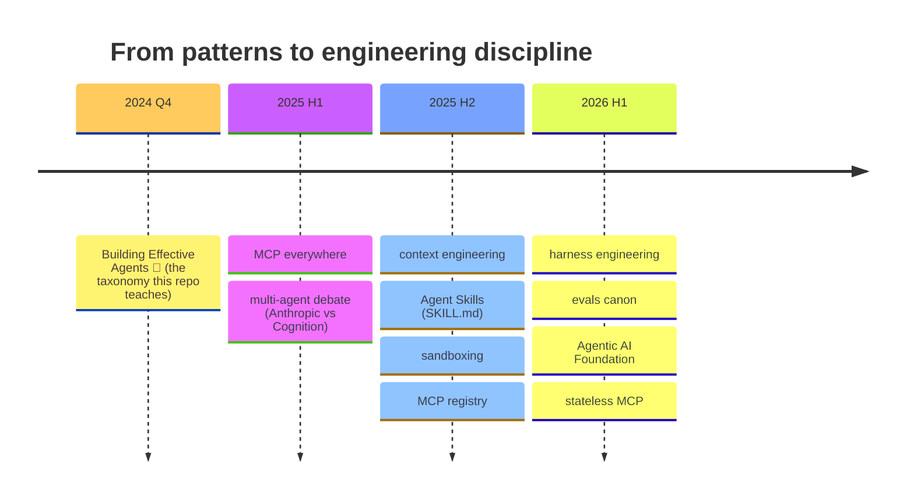

[🏠 Home](../README.md) › [Foundations](./) › **🗞️ What Changed (2025-2026)**

[← Augmented LLM](augmented-llm.md) ━━━━━━━━━━━━●━━━ [Workflows →](../workflows/)

---

# 🗞️ What Changed Since "Building Effective Agents"

> **TL;DR:** The Dec-2024 taxonomy this repo teaches is still the chapter 1 everyone cites — nothing was retracted. But by mid-2026 the canon tripled: context engineering replaced prompt engineering, a real multi-agent *debate* replaced the hype, skills/AGENTS.md/MCP became a de-facto config stack, and "harness engineering" became a job. This page is the map, every claim dated and sourced.

---

## The timeline at a glance

## 1 · Context engineering absorbed prompt engineering

The 2026 umbrella discipline: treat the context window as a **budget** — compaction, just-in-time retrieval, memory files, and sub-agents used primarily as **context isolation** (not as an org chart of little employees).

- Anthropic, [*Effective context engineering for AI agents*](https://www.anthropic.com/engineering/effective-context-engineering-for-ai-agents) (Sept 2025)
- LangChain, [*Context engineering for agents*](https://www.langchain.com/blog/context-engineering-for-agents)

> 🐔 The hen doesn't carry the whole farm in her head — she keeps the recipe card, and sends a chick to fetch what's missing.

## 2 · The multi-agent debate (both sides are required reading)

| Position | Source | Essence |
|---|---|---|
| **For** — orchestrator-workers at scale | Anthropic, [*Multi-agent research system*](https://www.anthropic.com/engineering/multi-agent-research-system) (June 2025) | parallel sub-agents crushed single-agent on breadth-first research… at ~15× the tokens |
| **Against** — don't split the context | Cognition, [*Don't Build Multi-Agents*](https://cognition.com/blog/dont-build-multi-agents) (June 2025) | fragmented context = compounding misunderstandings; prefer single-thread + compression |

The 2026 synthesis: **sub-agents for read-heavy, parallelizable work** (research, review, search); **one agent, one context for write-heavy work** (code, prose). Teach the trade-off, not a winner.

## 3 · Fewer, better tools — and code that calls them

The canon inverted "give the model lots of tools": design few ergonomic tools ([*Writing tools for agents*](https://www.anthropic.com/engineering/writing-tools-for-agents), Sept 2025), let the model search tools on demand and call them **from generated code** so intermediate results never bloat the context ([*Advanced tool use*](https://www.anthropic.com/engineering/advanced-tool-use), Nov 2025 · [*Code execution with MCP*](https://www.anthropic.com/engineering/code-execution-with-mcp), Nov 2025).

## 4 · The de-facto config stack (what each file layer owns)

| Layer | File | Who reads it (mid-2026) |
|---|---|---|
| Instructions | **AGENTS.md** ([agents.md](https://agents.md/)) | 60k+ repos; read natively by Codex, Copilot, Cursor, Gemini CLI, Devin, goose, Zed, Warp, opencode… (Claude Code via CLAUDE.md) |
| Procedures | **SKILL.md** — Agent Skills, [open spec Dec 2025](https://agentskills.io/specification) ([origin post](https://www.anthropic.com/engineering/equipping-agents-for-the-real-world-with-agent-skills)) | 30+ platforms by early 2026; progressive disclosure folders |
| Tools | **MCP** — [registry preview Sept 2025](https://blog.modelcontextprotocol.io/posts/2025-09-08-mcp-registry-preview/) · [`.mcpb` bundles](https://github.com/modelcontextprotocol/mcpb) · [2026-07-28 spec RC](https://blog.modelcontextprotocol.io/posts/2026-07-28-release-candidate/): **stateless core**, extensions first-class, roots/sampling/logging deprecated | ~9,400 distinct servers aggregated by April 2026 ([source](https://www.digitalapplied.com/blog/mcp-ecosystem-h1-2026-retrospective-adoption-data-points)) |
| Determinism | **Hooks** (this repo: [Hook](../implementation/components/hook.md)) | harness-specific |
| Workflows | **files** (this repo: [Patterns as Code](../patterns-as-code/)) | reviewed, checked, diffed like any code |

Governance went neutral: MCP, AGENTS.md and goose now live under the Linux Foundation's **[Agentic AI Foundation](https://aaif.io/)** (Dec 2025 · [Anthropic's donation post](https://www.anthropic.com/news/donating-the-model-context-protocol-and-establishing-of-the-agentic-ai-foundation)). Google's A2A [joined the LF in June 2025](https://developers.googleblog.com/en/google-cloud-donates-a2a-to-linux-foundation/) and claims [150+ orgs](https://www.linuxfoundation.org/press/a2a-protocol-surpasses-150-organizations-lands-in-major-cloud-platforms-and-sees-enterprise-production-use-in-first-year), though real-world adoption is [contested](https://www.credal.ai/blog/what-happened-to-a2a-protocol).

## 5 · Harness engineering — the 2026 word

Long-running agents made the **harness** (the loop *around* the model) the design surface: initializer/coder loops, JSON feature lists, incremental verified progress, and "decoupling the brain from the hands".

- [*Effective harnesses for long-running agents*](https://www.anthropic.com/engineering/effective-harnesses-for-long-running-agents) (Nov 2025)
- [*Harness design for long-running apps*](https://www.anthropic.com/engineering/harness-design-long-running-apps) (Mar 2026)
- [*Managed agents*](https://www.anthropic.com/engineering/managed-agents) (Apr 2026)

## 6 · Autonomy got fences: permissions → sandbox → containment

Autonomy stopped being a slider and became infrastructure: [sandboxing](https://www.anthropic.com/engineering/claude-code-sandboxing) (Oct 2025), [auto mode](https://www.anthropic.com/engineering/claude-code-auto-mode) (Mar 2026), [containment](https://www.anthropic.com/engineering/how-we-contain-claude) (2026). Pair with **budgets** (max turns / max tokens / max cost) — an autonomous agent without a fence is a chicken on a motorway. 🐔🛣️

## 7 · Evals moved to the core

[*Demystifying evals for AI agents*](https://www.anthropic.com/engineering/demystifying-evals-for-ai-agents) (Jan 2026). Field reality check: LangChain's [State of Agent Engineering](https://www.langchain.com/state-of-agent-engineering) (June 2026, n=1,300) — 57% run agents in production, 89% have observability, only 52% have evals. The gap **is** the lesson: traces without judgments are vibes.

## Vocabulary — alive vs fading

| 🟢 Alive (use these) | 🍂 Fading (flag these) |
|---|---|
| harness · context engineering · compaction · sub-agents as context isolation · skills · hooks · handoffs · guardrails · permission modes · sandboxing · tool use · traces | prompt engineering (absorbed) · OpenAI Assistants API (sunsets Aug 26, 2026) · MCP sampling/roots/logging (deprecated) · `.dxt` (→ `.mcpb`) · "function calling" (→ tool use) · AutoGPT-style loop-until-done |

---

[← Augmented LLM](augmented-llm.md) • [🏠 Home](../README.md) • [⚙️ Workflows →](../workflows/)

