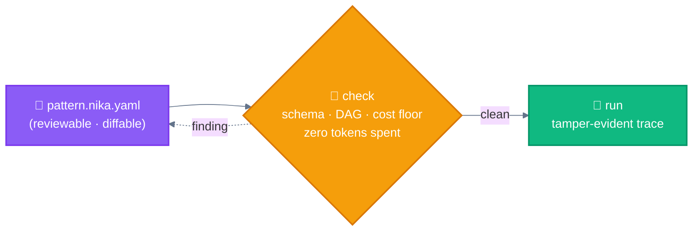

<div align="center">

[🏠 Home](../README.md) › **📜 Patterns as Code**

</div>

---

# 📜 Patterns as Code

> **TL;DR:** Every workflow pattern in this repo can be written down as a file — reviewed, diffed, checked *before* a single token is spent, and run with a tamper-evident trace after. This folder proves it: each pattern is a real, runnable `.nika.yaml`.

---

## Why write patterns as files?

The [taxonomy](../README.md#anthropic-taxonomy) says **workflows = code controls the flow**. But in most tutorials the "code" is a Python script you read once and never audit again. There is another way — the same way infra went from "SSH and click around" to Terraform:



The hen reads the recipe **before** turning on the oven. 🐔

## The five patterns, as files

Each file is self-contained, uses `model: mock/echo` (offline, **no API key**), and passes `nika check` — try them:

```bash
brew install supernovae-st/tap/nika    # single binary (or grab a release tarball)
nika check patterns-as-code/02-routing.nika.yaml
nika run   patterns-as-code/02-routing.nika.yaml
```

| Pattern | File | The pattern's essence, in file form |
|---------|------|-------------------------------------|
| [⛓️ Prompt Chaining](../workflows/01-prompt-chaining.md) | [`01-prompt-chaining.nika.yaml`](01-prompt-chaining.nika.yaml) | steps chained by `depends_on:` — `schema:` blocks ARE the 🚧 gates |
| [🚦 Routing](../workflows/02-routing.md) | [`02-routing.nika.yaml`](02-routing.nika.yaml) | one classifier, then `when:` (CEL) gates dispatch; non-matches skip |
| [🛤️ Parallelization](../workflows/03-parallelization.md) | [`03-parallelization.nika.yaml`](03-parallelization.nika.yaml) | no deps ⇒ implicit concurrency; `for_each` = voting fan-out with a cap |
| [🦑 Orchestrator-Workers](../workflows/04-orchestrator-workers.md) | [`04-orchestrator-workers.nika.yaml`](04-orchestrator-workers.nika.yaml) | planner invents the work list at runtime; the DAG shape stays fixed & reviewable |
| [🩻 Evaluator-Optimizer](../workflows/05-evaluator-optimizer.md) | [`05-evaluator-optimizer.nika.yaml`](05-evaluator-optimizer.nika.yaml) | generate → score against a schema → improve only `when:` the score says so |

And the [🐔 Autonomous Agent](../agents/autonomous.md) is a verb, not a diagram: an `agent:` task carries its **own budget** (`max_turns`, `max_tokens_total`) and a **default-deny tool whitelist** — autonomy inside a fence (see [`23-code-review`](https://github.com/supernovae-st/nika/blob/main/examples/23-code-review.nika.yaml) in the engine's examples).

## A checker that earns its keep

While writing these five files for this repo, `nika check` caught a real bug before any run: the evaluator-optimizer's `improve` step referenced `tasks.draft` without declaring `draft` in `depends_on` — an invisible race in most orchestration scripts, a named finding here (`NIKA-DAG-003`, with a docs URL). That is the point of patterns-as-code: **the pattern's correctness becomes machine-checkable.**

## Honest limits

- These files show the *patterns*; real workflows swap `mock/echo` for a provider (local-first: Ollama, llama.cpp, vLLM — then Mistral, Anthropic, OpenAI, and friends).
- Open-ended loops (the Autonomous Agent's territory) don't belong in a static DAG — Nika fences them inside the `agent:` verb rather than pretending a diagram can contain them.
- *Disclosure:* [Nika](https://github.com/supernovae-st/nika) (AGPL-3.0, Rust, single binary) is built by this repo's author. The pattern taxonomy above is Anthropic's; the files are one way to make it executable — [LangGraph](https://github.com/langchain-ai/langgraph), [Mastra](https://github.com/mastra-ai/mastra) and others are code-first takes on the same ideas.

---

<div align="center">

[🏠 Home](../README.md) • [⚙️ Workflows](../workflows/) • [🐔 Autonomous](../agents/)

</div>
