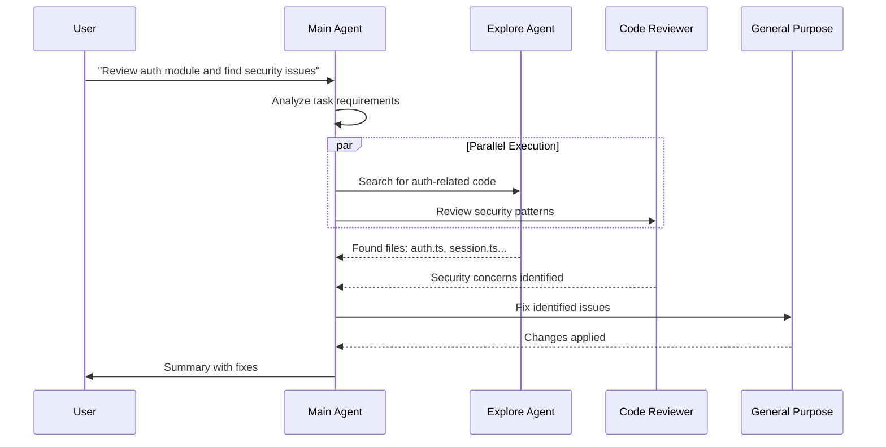
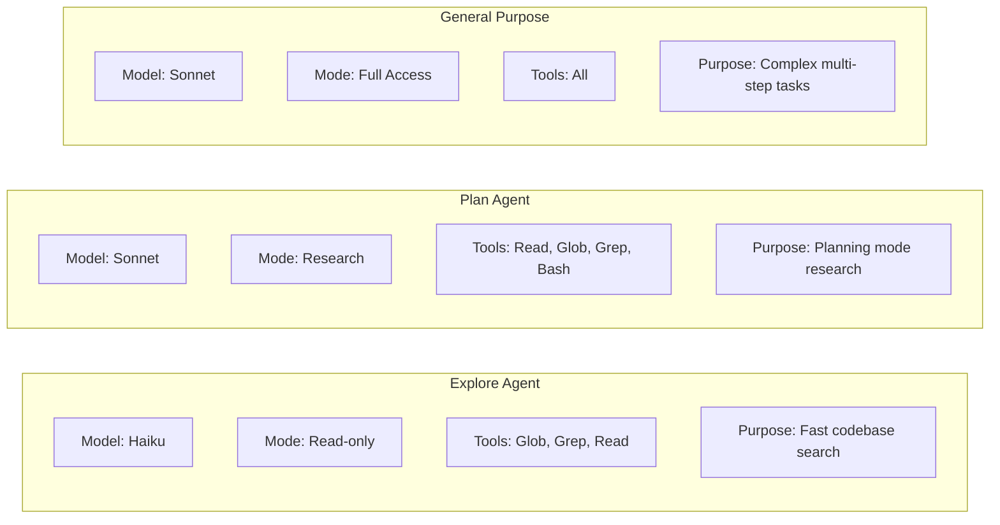
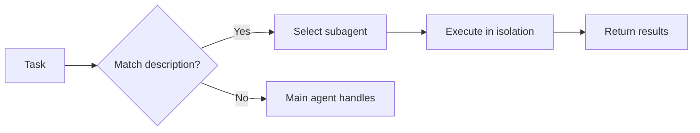
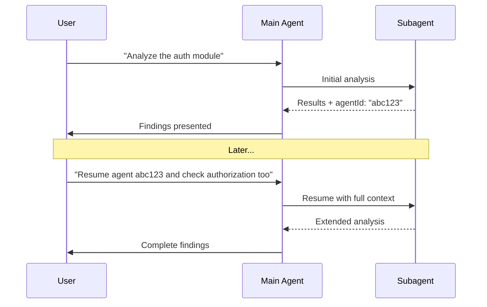

# Pattern 1: Subagent Orchestration

> Delegate specialized tasks to isolated agents with their own context, tools, and instructions.

---

## Overview

Subagents are pre-configured AI agents that Claude can delegate tasks to. Each subagent operates in its own context window, preventing information overload and keeping interactions focused.

## Architecture



## Key Benefits

| Benefit | Description |
|---------|-------------|
| **Context Preservation** | Each subagent operates in its own context, preventing pollution of the main conversation |
| **Specialized Expertise** | Tailored system prompts with specific best practices and constraints |
| **Parallelization** | Multiple subagents can run concurrently, speeding up complex workflows |
| **Tool Restrictions** | Limit tools per agent for security and focus |
| **Reusability** | Create once, use across different projects |

## Built-in Subagents



### Explore Agent
- **Model**: Haiku (fast, low-latency)
- **Mode**: Strictly read-only
- **Tools**: Glob, Grep, Read, limited Bash
- **Use case**: Rapid file discovery and code exploration

### Plan Agent
- **Model**: Sonnet
- **Mode**: Research only
- **Tools**: Read, Glob, Grep, Bash
- **Use case**: Automatic research during plan mode

### General Purpose Agent
- **Model**: Sonnet
- **Mode**: Full access
- **Tools**: All available
- **Use case**: Complex tasks requiring both exploration and modification

## Custom Subagent Configuration

### File Structure

```
.claude/agents/
├── code-reviewer.md
├── security-scanner.md
├── test-runner.md
└── debugger.md
```

### Configuration Format

```yaml
---
name: security-reviewer
description: Security code reviewer. Use PROACTIVELY after code changes involving auth, crypto, or user data.
tools: Read, Grep, Glob, Bash
model: sonnet
permissionMode: default
skills: security-checklist
---

You are a security-focused code reviewer specializing in:
- Authentication vulnerabilities
- Input validation
- SQL injection prevention
- XSS prevention

## When Invoked

1. Run `git diff` to see recent changes
2. Focus on security-critical code paths
3. Check for OWASP Top 10 vulnerabilities

## Report Format

Organize findings by severity:
- **Critical** - Must fix before merge
- **Warning** - Should fix
- **Info** - Consider improving
```

### Configuration Fields

| Field | Required | Description |
|-------|----------|-------------|
| `name` | Yes | Unique identifier (lowercase, hyphens) |
| `description` | Yes | Natural language description - triggers auto-invocation |
| `tools` | No | Comma-separated list of allowed tools |
| `model` | No | `sonnet`, `opus`, `haiku`, or `inherit` |
| `permissionMode` | No | `default`, `acceptEdits`, `bypassPermissions`, `plan` |
| `skills` | No | Comma-separated list of skills to auto-load |

## Invocation Patterns

### Automatic Delegation

Claude automatically delegates based on task description matching:



**Pro tip**: Include "use PROACTIVELY" or "MUST BE USED" in descriptions to encourage automatic invocation.

### Explicit Invocation

```
> Use the code-reviewer subagent to check the auth module
> Have the debugger subagent investigate this error
```

### Chaining Subagents

```
> First use the code-analyzer subagent to find performance issues,
> then use the optimizer subagent to fix them
```

## Resumable Sessions

Subagents support resumption for multi-turn workflows:



### Programmatic Resume

```typescript
{
  "description": "Continue analysis",
  "prompt": "Now examine the error handling patterns",
  "subagent_type": "code-analyzer",
  "resume": "abc123"  // Agent ID from previous execution
}
```

## SDK Integration

### Programmatic Definition

```typescript
import { query } from '@anthropic-ai/claude-agent-sdk';

const result = query({
  prompt: "Review the authentication module",
  options: {
    agents: {
      'code-reviewer': {
        description: 'Expert code review specialist. Use for quality and security reviews.',
        prompt: `You are a code review specialist...`,
        tools: ['Read', 'Grep', 'Glob'],
        model: 'sonnet'
      },
      'test-runner': {
        description: 'Runs and analyzes test suites.',
        prompt: `You are a test execution specialist...`,
        tools: ['Bash', 'Read', 'Grep'],
      }
    }
  }
});
```

### Dynamic Configuration

```typescript
function createSecurityAgent(level: 'basic' | 'strict'): AgentDefinition {
  return {
    description: 'Security code reviewer',
    prompt: `You are a ${level === 'strict' ? 'strict' : 'balanced'} security reviewer...`,
    tools: ['Read', 'Grep', 'Glob'],
    model: level === 'strict' ? 'opus' : 'sonnet'
  };
}
```

## Best Practices

### Do

- Create focused single-purpose subagents
- Write detailed descriptions for auto-invocation
- Limit tool access to what's necessary
- Version control project subagents in `.claude/agents/`
- Use `inherit` model for consistency when needed

### Don't

- Create monolithic multi-purpose agents
- Skip tool restrictions for convenience
- Rely on explicit invocation only
- Forget to test automatic delegation

## Common Tool Combinations

| Agent Type | Tools | Use Case |
|------------|-------|----------|
| **Read-only** | `Read, Grep, Glob` | Analysis, review |
| **Test runner** | `Bash, Read, Grep` | Test execution |
| **Code modifier** | `Read, Edit, Write, Grep, Glob` | Implementation |
| **Full access** | All tools | Complex multi-step tasks |

---

## References

- [Claude Code: Subagents Documentation](https://code.claude.com/docs/en/sub-agents)
- [Agent SDK: Subagents](https://docs.anthropic.com/docs/en/agent-sdk/subagents)
