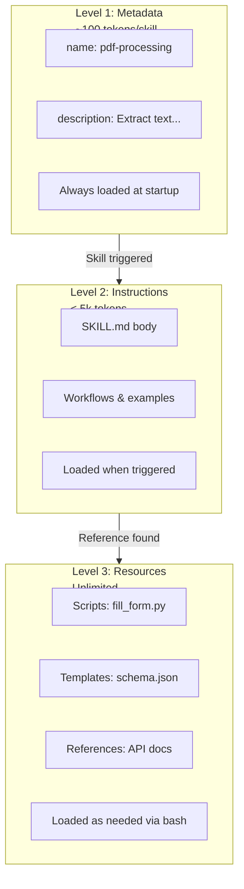
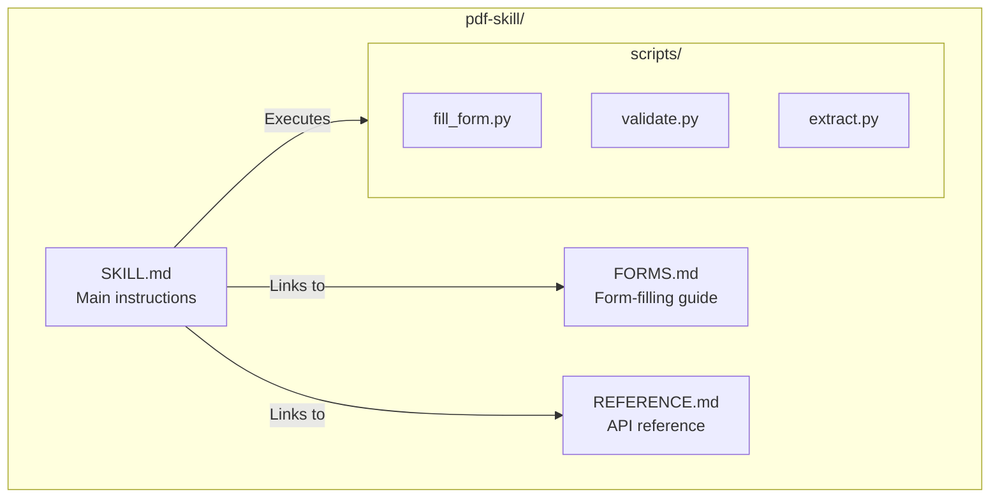
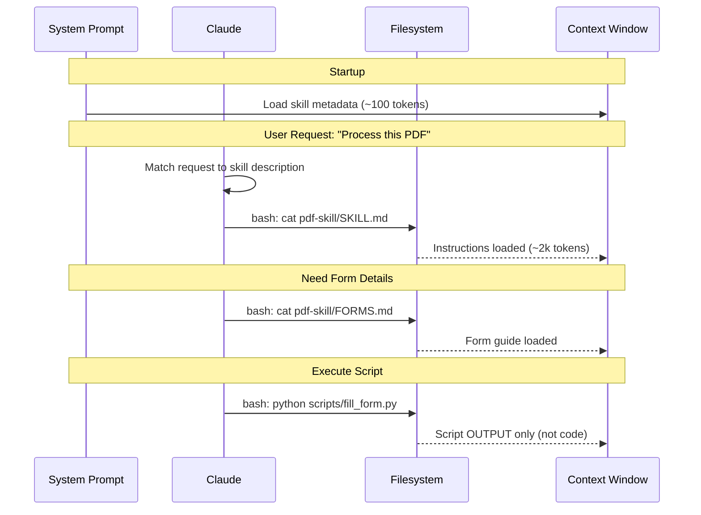
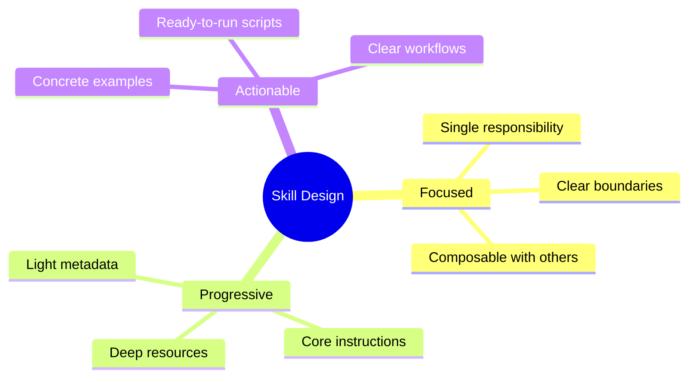

# Pattern 2: Agent Skills & Progressive Disclosure

> Modular capabilities that extend Claude with domain-specific expertise through on-demand loading.

---

## Overview

Agent Skills are filesystem-based resources that provide Claude with workflows, context, and best practices. Unlike prompts (one-off instructions), Skills load on-demand and eliminate repetition across conversations.

## Progressive Disclosure Architecture



## Three Levels of Loading

| Level | When Loaded | Token Cost | Content Type |
|-------|------------|------------|--------------|
| **Level 1: Metadata** | Always (startup) | ~100 tokens/skill | `name` and `description` from YAML |
| **Level 2: Instructions** | When triggered | < 5k tokens | SKILL.md body with guidance |
| **Level 3: Resources** | As needed | Effectively unlimited | Scripts, templates, references |

## Skill Structure



### Directory Layout

```
my-skill/
├── SKILL.md           # Main instructions (required)
├── ADVANCED.md        # Advanced workflows
├── REFERENCE.md       # API reference
├── templates/
│   ├── report.html
│   └── schema.json
└── scripts/
    ├── validate.py
    └── process.py
```

## SKILL.md Format

```yaml
---
name: data-processor
description: Process and transform data files. Use when working with CSV, JSON, or Excel files for data cleaning, transformation, or analysis.
---

# Data Processor

## Quick Start

For basic CSV processing:

```python
import pandas as pd
df = pd.read_csv("data.csv")
```

## Workflows

### Data Cleaning
1. Load the data file
2. Check for missing values
3. Apply transformations
4. Validate output

For advanced transformations, see [ADVANCED.md](ADVANCED.md).

## Scripts

Run validation: `python scripts/validate.py input.csv`
```

### Required Fields

| Field | Constraints |
|-------|-------------|
| `name` | Max 64 chars, lowercase + hyphens only, no "anthropic"/"claude" |
| `description` | Non-empty, max 1024 chars, describes what + when to use |

## Loading Sequence



## Content Types

### Instructions (Markdown files)
- Flexible guidance and workflows
- Load into context when referenced
- Best for: Procedures, best practices, decision trees

### Code (Scripts)
- Deterministic operations
- Only OUTPUT enters context (not source code)
- Best for: Validation, transformations, calculations

### Resources (Reference files)
- Static reference materials
- Load on-demand
- Best for: Schemas, templates, documentation

## Skill Locations

| Type | Location | Scope |
|------|----------|-------|
| **Project skills** | `.claude/skills/` | Current project only |
| **User skills** | `~/.claude/skills/` | All projects |
| **Plugin skills** | Plugin's `skills/` directory | Depends on plugin scope |

## Pre-built Skills

Available on Claude.ai and API:

| Skill | ID | Purpose |
|-------|-----|---------|
| **PowerPoint** | `pptx` | Create/edit presentations |
| **Excel** | `xlsx` | Create spreadsheets, analyze data |
| **Word** | `docx` | Create/edit documents |
| **PDF** | `pdf` | Generate PDF reports |

## Creating Custom Skills

### Step 1: Create Directory

```bash
mkdir -p .claude/skills/my-skill
```

### Step 2: Write SKILL.md

```yaml
---
name: my-skill
description: Brief description of what this does and when to use it.
---

# My Skill

## Instructions
[Step-by-step guidance]

## Examples
[Concrete examples]
```

### Step 3: Add Resources (Optional)

```bash
# Add reference docs
echo "# API Reference" > .claude/skills/my-skill/REFERENCE.md

# Add scripts
mkdir .claude/skills/my-skill/scripts
echo "print('Hello')" > .claude/skills/my-skill/scripts/helper.py
```

## Best Practices

### Writing Effective Descriptions

**Good**: `"Process PDF forms - extract data, fill fields, validate. Use when user mentions PDFs, forms, or document extraction."`

**Bad**: `"PDF stuff"`

### Skill Design Principles



### Do

- Write clear descriptions that trigger correctly
- Use progressive loading (don't dump everything in SKILL.md)
- Bundle scripts for deterministic operations
- Include concrete examples
- Test trigger conditions

### Don't

- Create overly broad "do everything" skills
- Put large content in Level 1 metadata
- Require network access when not available
- Skip the description field

## Platform Availability

| Platform | Pre-built Skills | Custom Skills | Notes |
|----------|-----------------|---------------|-------|
| **Claude.ai** | Yes | Yes (zip upload) | Individual user only |
| **Claude API** | Yes | Yes (API upload) | Workspace-wide |
| **Claude Code** | No | Yes (filesystem) | Project or user level |
| **Agent SDK** | No | Yes (filesystem) | Via `.claude/skills/` |

## Runtime Constraints

| Platform | Network | Package Install | Notes |
|----------|---------|-----------------|-------|
| **Claude.ai** | Varies | No | Depends on user/admin settings |
| **API** | No | No | Pre-configured only |
| **Claude Code** | Yes | Local only | Full access |

---

## References

- [Agent Skills Overview](https://docs.anthropic.com/docs/en/agents-and-tools/agent-skills/overview)
- [Skills Best Practices](https://docs.anthropic.com/docs/en/agents-and-tools/agent-skills/best-practices)
- [Engineering Blog: Equipping Agents with Skills](https://www.anthropic.com/engineering/equipping-agents-for-the-real-world-with-agent-skills)
- [Skills Cookbook](https://github.com/anthropics/claude-cookbooks/tree/main/skills)
