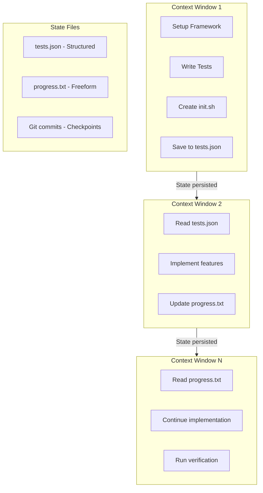
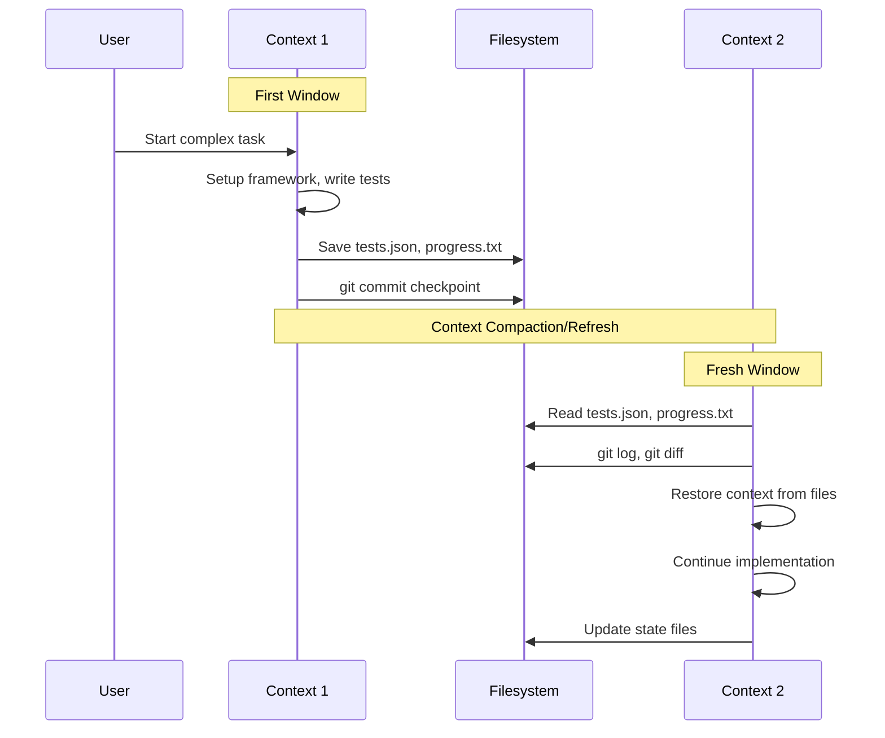
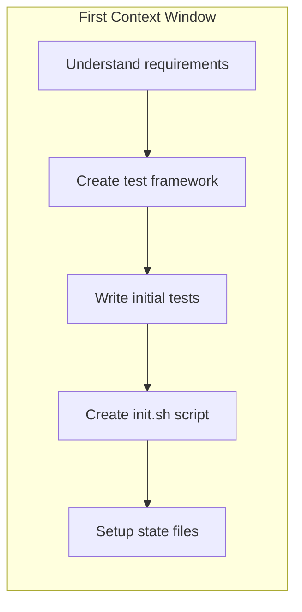
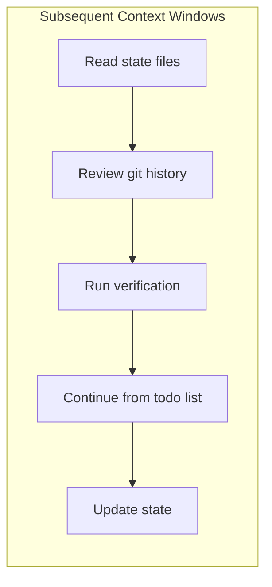
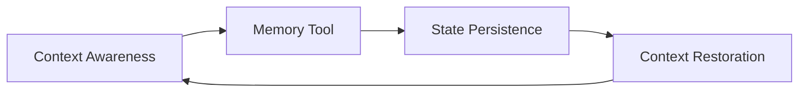

# Pattern 5: Multi-Window Context Management

> Persist state across context windows for long-running agentic tasks.

---

## Overview

Claude 4.5 models excel at long-horizon reasoning with exceptional state tracking. This pattern enables complex tasks that span multiple context windows by systematically persisting and restoring state.

## Architecture



## Context Awareness

Claude 4.5 models feature **context awareness** - the ability to track remaining context window ("token budget") throughout a conversation. This enables:

- Better task planning
- Proactive state saving before limits
- Efficient context utilization

## State Persistence Strategies

### Structured State (JSON/YAML)

Best for: Query-able data, test status, configuration

```json
// tests.json
{
  "tests": [
    {"id": 1, "name": "auth_flow", "status": "passing"},
    {"id": 2, "name": "user_mgmt", "status": "failing"},
    {"id": 3, "name": "api_endpoints", "status": "not_started"}
  ],
  "total": 200,
  "passing": 150,
  "failing": 25,
  "not_started": 25
}
```

### Freeform Notes (Markdown/Text)

Best for: Progress tracking, context, decisions

```markdown
// progress.txt
Session 3 Progress:
- Fixed authentication token validation
- Updated user model for edge cases
- Next: investigate user_management test failures (test #2)
- Note: Do not remove tests - could lead to missing functionality

Blockers:
- Need to clarify API rate limit requirements

Decisions Made:
- Using JWT over sessions (performance reasons)
- Keeping backwards compatibility for v1 API
```

### Git Checkpoints

Best for: Code state, rollback capability, audit trail

```bash
# Regular commits as checkpoints
git add . && git commit -m "WIP: auth module 50% complete"

# Use git log for state discovery
git log --oneline -10

# Use git diff for change tracking
git diff HEAD~1
```

## Multi-Window Workflow



## Recommended Prompts

### For Autonomous Long Tasks

```text
Your context window will be automatically compacted as it approaches
its limit, allowing you to continue working indefinitely from where
you left off.

Therefore, do not stop tasks early due to token budget concerns.

As you approach your token budget limit, save your current progress
and state to memory before the context window refreshes.

Always be as persistent and autonomous as possible and complete tasks
fully, even if the end of your budget is approaching.

Never artificially stop any task early regardless of the context
remaining.
```

### For State Management

```text
State Management Protocol:

SAVE (before context limits):
1. Update tests.json with current test status
2. Write progress summary to progress.txt
3. Commit work-in-progress: git add . && git commit -m "WIP: [status]"

RESTORE (when starting fresh):
1. Run: pwd
2. Read: progress.txt, tests.json
3. Review: git log --oneline -5, git diff
4. Run integration test before new features

Files are your memory. Save early, save often.
```

## First Window vs Subsequent Windows

### First Window Strategy



Focus on:
- Setting up verification framework
- Creating automation scripts
- Establishing state file structure

### Subsequent Windows Strategy



Focus on:
- Quick context restoration
- Verification before changes
- Incremental progress

## State File Templates

### tests.json

```json
{
  "schema_version": 1,
  "last_updated": "2025-01-15T10:30:00Z",
  "summary": {
    "total": 50,
    "passing": 35,
    "failing": 10,
    "skipped": 5
  },
  "tests": [
    {
      "id": "auth-001",
      "name": "User login flow",
      "file": "tests/auth.test.ts",
      "status": "passing",
      "notes": ""
    }
  ],
  "next_priority": ["auth-005", "user-002"]
}
```

### progress.txt

```markdown
# Project: Feature Implementation
# Started: 2025-01-15
# Current Session: 4

## Completed
- [x] Setup test framework
- [x] Auth module (100%)
- [x] User management (75%)

## In Progress
- [ ] API endpoints (50%)
  - Done: GET /users, POST /users
  - Remaining: PUT /users, DELETE /users

## Blocked
- Rate limiting implementation (waiting for requirements)

## Next Steps
1. Complete PUT /users endpoint
2. Add validation tests
3. Review error handling

## Notes
- Using Jest for testing
- API follows REST conventions
- See API.md for endpoint specs
```

### init.sh

```bash
#!/bin/bash
# Initialization script for fresh context windows

echo "=== Project Status ==="
pwd
echo ""

echo "=== Recent Progress ==="
cat progress.txt | head -30
echo ""

echo "=== Test Status ==="
cat tests.json | jq '.summary'
echo ""

echo "=== Recent Commits ==="
git log --oneline -5
echo ""

echo "=== Uncommitted Changes ==="
git status --short
echo ""

echo "=== Running Quick Verification ==="
npm test -- --testPathPattern="smoke" --silent
```

## Best Practices

### Do

- Use structured formats (JSON) for queryable state
- Use freeform text for context and decisions
- Commit frequently as checkpoints
- Create init.sh for quick restoration
- Run verification before continuing work

### Don't

- Rely on context alone for long tasks
- Skip state saving before limits
- Remove tests (could lose coverage)
- Forget to document decisions
- Start new features without verification

## Memory Tool Integration

Claude's [Memory Tool](https://docs.anthropic.com/docs/en/agents-and-tools/tool-use/memory-tool) pairs naturally with context awareness for seamless transitions:



---

## References

- [Claude 4.5 Best Practices: Long-horizon Reasoning](https://docs.anthropic.com/docs/en/build-with-claude/prompt-engineering/claude-4-best-practices#long-horizon-reasoning-and-state-tracking)
- [Memory Tool Documentation](https://docs.anthropic.com/docs/en/agents-and-tools/tool-use/memory-tool)
- [Context Windows](https://docs.anthropic.com/docs/en/build-with-claude/context-windows)
