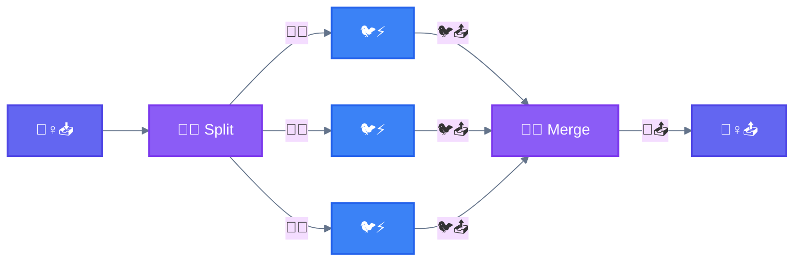
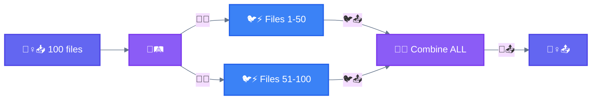
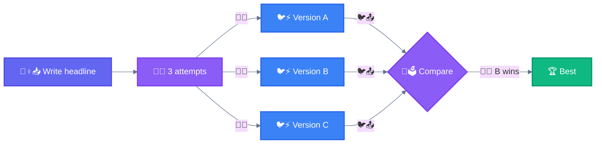
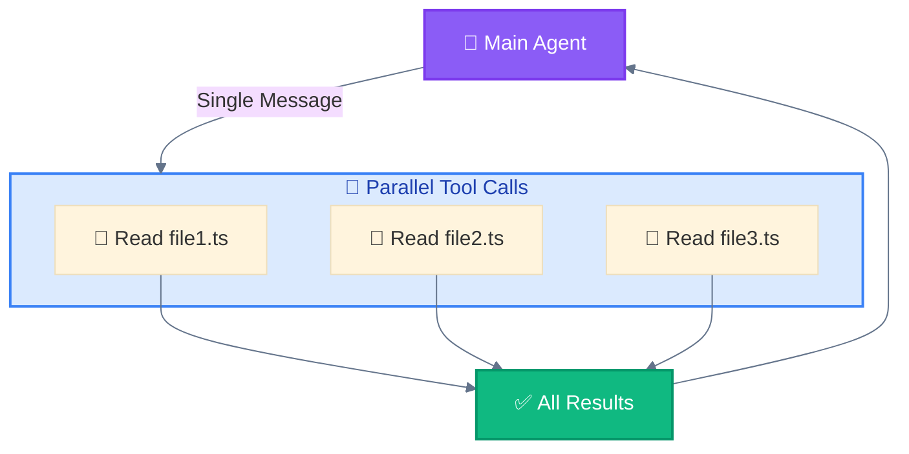
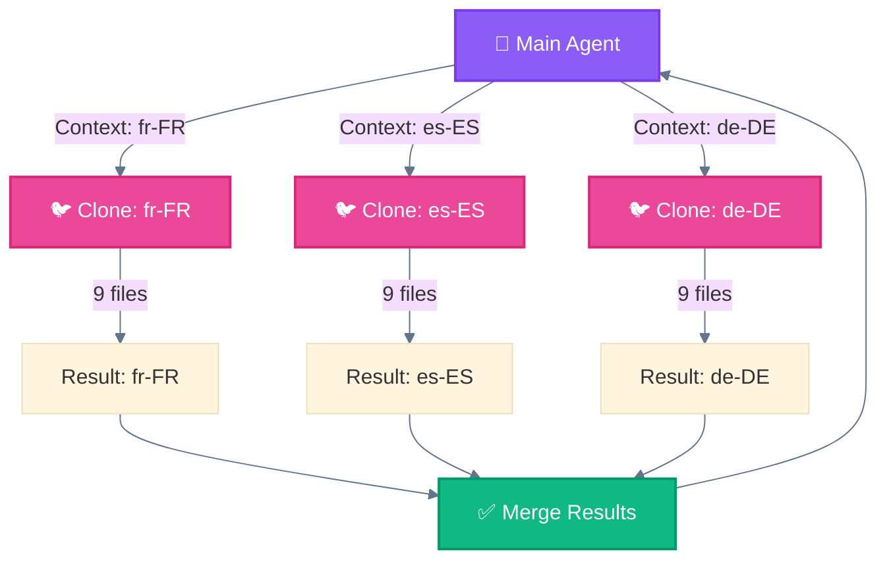

<div align="center">

[🏠 Home](../README.md) › [Workflows](./) › **🛤️ Parallelization**

[← 02 Routing](02-routing.md) ━━━━━━━━━━━━━━━━●━━━━━━━━━━━━━━━━━━━ [04 Orchestrator-Workers →](04-orchestrator-workers.md)

</div>

---

# 🛤️ Parallelization

> **TL;DR:** Execute independent tasks simultaneously and aggregate outputs. Two flavors: **Sectioning** (split data, combine all) and **Voting** (same task, pick best).

---

## Core Concept



---

**What it looks like for real** — parallel waves executing in the terminal (tasks with no mutual deps run concurrently, the lanes are the fan-out):


*From the runnable version of this exact pattern: [`03-parallelization.nika.yaml`](../patterns-as-code/03-parallelization.nika.yaml) — offline, no API key.*

## Key Insight

```
┌─────────────────────────────────────────────────────────────────────────────┐
│  ⚠️  IMPORTANT: Parallelization vs Orchestrator-Workers                     │
├─────────────────────────────────────────────────────────────────────────────┤
│                                                                             │
│  In Parallelization, all spawned subagents are IDENTICAL.                   │
│  Same prompt, same capabilities. They are INTERCHANGEABLE.                  │
│                                                                             │
│  🛤️ Parallelization:        🐦⚡ = 🐦⚡ = 🐦⚡   (clones)                     │
│  🦑 Orchestrator-Workers:   🐦🔒 ≠ 🐦⚡ ≠ 🐦🎨   (specialists)               │
│                                                                             │
└─────────────────────────────────────────────────────────────────────────────┘
```

---

## Characteristics

| Property | Value |
|----------|-------|
| **Complexity** | Medium |
| **Parallelism** | High |
| **Human-Loop** | Optional |
| **Iteration** | None |

---

## 2 Types of Parallelization

### Type 1: 🛤️ Sectioning (Split DATA)

Break a task into independent subtasks run in parallel, then **combine ALL** results.



**Examples:**
- Guardrails: One instance processes queries, another screens for inappropriate content
- Evals: Each LLM call evaluates a different aspect of model performance

### Type 2: 🗳️ Voting (Same TASK, pick BEST)

Run the same task multiple times to get diverse outputs, then **select the best**.



---

## Voting Selection Strategies

| Strategy | How It Works | Best For |
|----------|--------------|----------|
| **LLM Judge** | Main Agent compares outputs and selects best | Creative content, subjective quality |
| **Scoring Rubric** | Each output scored against criteria, highest wins | Code review, compliance checks |
| **Consensus** | Majority agreement required | Critical decisions, validation |
| **Weighted Vote** | Outputs weighted by model capability | Mixed model ensemble |

---

## Summary

| Type | Workers | Input | Output |
|------|---------|-------|--------|
| **🛤️ Sectioning** | IDENTICAL | Different DATA chunks | Combine ALL |
| **🗳️ Voting** | IDENTICAL | Same DATA | Pick ONE best |

---

## When to Use

Parallelization is effective when the divided subtasks can be parallelized for speed, or when multiple perspectives are needed for higher confidence results.

---

## When NOT to Use

- Tasks depend on each other's output
- Sequential order matters
- Limited resources

---

## Variant: 🚂 Parallel Tool Calling

Execute multiple independent 🔧 tool calls in a single message for efficiency.



---

## Variant: 🧬 Master-Clone

Spawn multiple isolated 🐦 instances handling independent domains with no shared state.

### Key Characteristics

| Property | Value |
|----------|-------|
| **Isolation** | Complete - each clone has own context |
| **State Sharing** | None - clones cannot communicate |
| **Best For** | Independent domains, parallel generation |
| **Merge Strategy** | Combine all outputs (no conflict resolution needed) |

### Diagram



### When to Use Master-Clone

| Use Case | Why Master-Clone? |
|----------|-------------------|
| **Multi-locale generation** | Each locale is independent domain |
| **Multi-platform builds** | iOS, Android, Web don't share state |
| **Parallel documentation** | Each doc section is self-contained |
| **A/B test generation** | Variants shouldn't influence each other |
| **Multi-tenant operations** | Tenant data must be isolated |

---


---

## 📜 This pattern, as a file

Runnable version (offline mock, no API key · `nika check` proves the DAG before any token is spent): [`patterns-as-code/03-parallelization.nika.yaml`](../patterns-as-code/03-parallelization.nika.yaml) — see [Patterns as Code](../patterns-as-code/).

<div align="center">

[← 02 Routing](02-routing.md) ━━━━━━━━━━━━━━━━●━━━━━━━━━━━━━━━━━━━ [04 Orchestrator-Workers →](04-orchestrator-workers.md)

</div>
